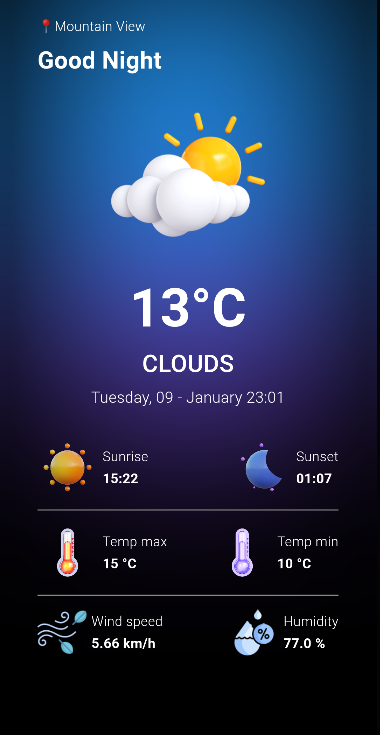

# Flutter Weather App


Um aplicativo simples em Flutter para obter a previsão do tempo, temperatura máxima, temperatura mínima, nascer do sol e pôr do sol da cidade em que você está. O aplicativo utiliza a API externa chamada "Weather API" do OpenWeatherMap.

## Configuração

Antes de começar, é necessário obter uma chave de API gratuita do OpenWeatherMap em https://openweathermap.org/api. Substitua `SUA_CHAVE_API` no arquivo `lib/services/weather_service.dart` pela chave que você recebeu.

## Bibliotecas Utilizadas

O projeto utiliza as seguintes bibliotecas Flutter:

- [geolocator](https://pub.dev/packages/geolocator): ^10.0.1
- [weather](https://pub.dev/packages/weather): ^3.1.1
- [intl](https://pub.dev/packages/intl): ^0.18.1
- [flutter_bloc](https://pub.dev/packages/flutter_bloc): ^8.1.3
- [equatable](https://pub.dev/packages/equatable): ^2.0.5

Certifique-se de adicionar essas dependências ao arquivo `pubspec.yaml` do seu projeto.

```yaml
dependencies:
  geolocator: ^10.0.1
  weather: ^3.1.1
  intl: ^0.18.1
  flutter_bloc: ^8.1.3
  equatable: ^2.0.5
  ```
## Como Executar
Certifique-se de ter o Flutter instalado. Se ainda não tiver, siga as instruções em https://flutter.dev/docs/get-started/install.

1. Clone este repositório:
~~~bash
git clone https://github.com/seu-usuario/seu-projeto.git
cd seu-projeto
~~~

2.  Instale as dependências:
~~~bash
flutter pub get
~~~

3. Execute o aplicativo:
~~~bash
flutter run
~~~

## Funcionalidades
 - Exibir a previsão do tempo atual
 - Mostrar temperatura máxima e mínima
 - Informações sobre o nascer do sol e pôr do sol
 - Localização automática usando Geolocator

## Contribuição
Contribuições são bem-vindas! Sinta-se à vontade para abrir problemas (issues) e enviar pull requests.

## Licença
Este projeto está licenciado sob a MIT License.

Certifique-se de substituir `SUA_CHAVE_API` pela chave de `API` que você obteve do `OpenWeatherMap`. Personalize as funcionalidades de acordo com o que já foi implementado em seu aplicativo.
